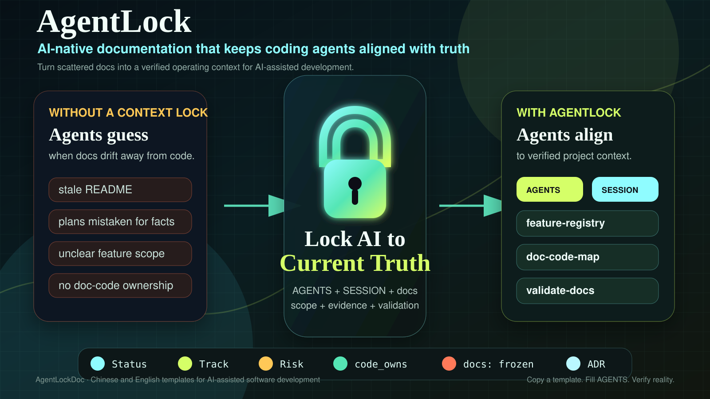

# AgentLockDoc

> **AgentLock** is an AI-native documentation template system for software projects.  
> It keeps coding agents aligned with the current truth of your codebase: scope, source-of-truth docs, feature state, doc-code ownership, validation rules, and safe handoff context across sessions.

[中文](README.md) · [Chinese Template](templates/zh-CN/README.md) · [English Template](templates/en-US/README.md) · [MIT License](LICENSE)



---

## What This Repository Contains

AgentLockDoc is an open-source template repository. The repository root explains the project, license, and usage. The actual templates that users copy into their own projects live under:

| Template Directory | Language | How to Use |
|--------------------|----------|------------|
| [templates/zh-CN](templates/zh-CN) | Chinese | Copy the full contents into a Chinese-language project |
| [templates/en-US](templates/en-US) | English | Copy the full contents into an English-language project |

The GitHub repository can be named **AgentLockDoc**. The product / methodology name is **AgentLock**.

---

## Why AgentLock Exists

AI coding is moving from one-shot autocomplete to long-running engineering collaboration. That shift creates a new class of problems:

- Coding agents do not know which docs are current, draft, historical, or superseded.
- READMEs, design docs, implementation plans, and actual code drift apart over time.
- A new AI session cannot reliably tell what is in scope, out of scope, or already implemented.
- Feature scope, code entrypoints, validation evidence, and source-of-truth docs are scattered.
- Agents may treat ideas, plans, or discussion notes as implemented reality.
- High-risk changes often lack a consistent pause, review, and close-out protocol.

AgentLock turns documentation into an operational context layer: current truth, authority, scope, ownership, and evidence.

---

## Capabilities

| Capability | What it does |
|------------|--------------|
| AI entrypoint | AGENTS + SESSION + docs index restore project context quickly |
| Status governance | Current / Draft / Unverified / Superseded / Archived prevent stale-doc mistakes |
| Scope control | NOW / BOTH / LATER separates current work from future candidates |
| Verified code reality | R-xxx entries capture implementation facts with evidence |
| doc-code mapping | code_owns + doc-code-map connect code paths to authority docs |
| Feature registry | one table for feature scope, status, docs, code entrypoints, and validation |
| Evolution backlog | stores future ideas without polluting the current phase |
| ADRs | record architectural decisions and trade-offs |
| Starter profiles | Agent Platform, CLI Tool, Web SaaS, Library / SDK, Software Automation |
| Process metadata | lets agents load process docs only when relevant |
| Validation script | checks key files, front-matter, process metadata, and Markdown links |
| Script extension guide | helps agents generate project-specific doc-code-map and drift-check scripts |

---

## Repository Layout

```text
AgentLockDoc/
  README.md                 # Chinese project README
  README.en.md              # English project README
  LICENSE                   # MIT License
  templates/
    zh-CN/                  # complete Chinese template
      AGENTS.md
      SESSION.md
      DOCS_MAINTENANCE.md
      NEW_PROJECT_CHECKLIST.md
      docs/
      profiles/
      scripts/
    en-US/                  # complete English template
      AGENTS.md
      SESSION.md
      DOCS_MAINTENANCE.md
      NEW_PROJECT_CHECKLIST.md
      docs/
      profiles/
      scripts/
```

The root README is not part of the project-local template. Users should copy one language directory into their own project.

---

## Quick Start

### Chinese project

```bash
cp -R templates/zh-CN/. /path/to/your-project/
cd /path/to/your-project
node scripts/validate-docs.mjs
```

Then follow [templates/zh-CN/NEW_PROJECT_CHECKLIST.md](templates/zh-CN/NEW_PROJECT_CHECKLIST.md). After copying, it will be available as `NEW_PROJECT_CHECKLIST.md` in your project root.

### English project

```bash
cp -R templates/en-US/. /path/to/your-project/
cd /path/to/your-project
node scripts/validate-docs.mjs
```

Then follow [templates/en-US/NEW_PROJECT_CHECKLIST.md](templates/en-US/NEW_PROJECT_CHECKLIST.md). After copying, it will be available as `NEW_PROJECT_CHECKLIST.md` in your project root.

### Keep AgentLock in a subdirectory

If you do not want AGENTS.md and SESSION.md at the project root, copy a language directory into a subdirectory:

```bash
cp -R templates/en-US /path/to/your-project/agentlock-docs
```

This is more conservative, but coding agents may not discover the entrypoints automatically. For agent-first projects, copying the selected template contents to the project root is recommended.

---

## Benefits

### For individual developers

- AI sessions can resume context faster.
- Agents stop guessing which docs matter.
- Stale plans are less likely to be implemented as if they were current truth.
- Small projects get lightweight discipline without heavyweight process.

### For teams

- Docs, code, feature scope, and validation evidence become traceable.
- New teammates and AI agents start from the same entrypoints.
- Discussion notes do not silently become unofficial specifications.
- Future ideas are separated from current delivery scope.
- Risky changes have a consistent pause and close-out protocol.

### For long-running projects

- Documentation and code drift becomes visible.
- Architectural decisions keep their rationale without polluting active specs.
- Teams can evolve from prototype to production with progressive governance.
- Validation scripts and CI checks can be added as the project matures.

---

## Recommended Prompt for Coding Agents

After copying one template into a real project, tell your coding agent:

```text
Read AGENTS.md, SESSION.md, docs/README.md, and the Current source-of-truth document related to this task.
Follow Status / Track / Risk / front-matter rules in docs/08-process/conventions.md.
If code changes affect APIs, data models, configuration, deployment, permissions, security, architecture boundaries, user-visible behavior, or acceptance criteria, update the corresponding authority docs.
At close-out, run node scripts/validate-docs.mjs and report validation results, documentation impact, and next steps.
```

---

## Built-in Profiles

Both templates include the same profile structure:

- Agent Platform
- CLI Tool
- Web SaaS
- Library / SDK
- Software Automation

Chinese entry: [templates/zh-CN/profiles/README.md](templates/zh-CN/profiles/README.md)  
English entry: [templates/en-US/profiles/README.md](templates/en-US/profiles/README.md)

---

## Validation

Both templates ship with a zero-dependency Node.js validator:

```bash
node scripts/validate-docs.mjs
```

Validate both templates inside this repository:

```bash
cd templates/zh-CN && node scripts/validate-docs.mjs
cd ../en-US && node scripts/validate-docs.mjs
```

The base templates have no real code paths, so `no document declares code_owns yet` is expected. Add real globs after installing AgentLock in a real project.

---

## Roadmap

- [x] Complete Chinese template
- [x] Complete English template
- [x] Current truth entrypoints: AGENTS / SESSION / docs index
- [x] Status / Track / Risk / front-matter conventions
- [x] Feature registry, evolution backlog, stage view
- [x] doc-code-map convention and script extension guide
- [x] Starter profiles
- [x] ADR template
- [x] Validation script
- [ ] Optional CLI initializer
- [ ] Optional GitHub Action example
- [ ] Optional doc-code-map generator examples for popular stacks

---

## License

AgentLockDoc is released under the [MIT License](LICENSE).
